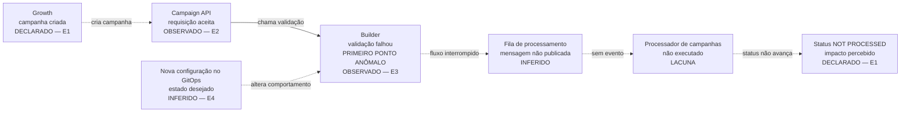

# Formato de entrega do post-mortem Blip

Use esta estrutura em toda entrega. Ela reproduz a ordem observada nos post-mortems da Blip e acrescenta um anexo técnico para o diagnóstico reproduzível. O portão de viabilidade define a modalidade:

A entrega final é um PDF A4, não um bloco Markdown. Use esta referência para estruturar o conteúdo, serialize o resultado em JSON e gere o artefato com `scripts/render_blip_postmortem.py`, seguindo [blip-pdf-visual-standard.md](blip-pdf-visual-standard.md). O Markdown abaixo define a semântica e a ordem; o gerador define a identidade visual.

- **com evidência suficiente:** `POST MORTEM — <título>`;
- **bloqueado por evidência:** `POST MORTEM — DIAGNÓSTICO PARCIAL — <título>`.

Na modalidade parcial, preserve todas as seções oficiais, mas seja conciso: use `não determinado` nos campos sem prova, não escreva ações futuras genéricas e inclua o próximo desbloqueio prioritário. A falta de evidência reduz o conteúdo, não remove o formato.

## Regras de classificação

- Use `Classificação: INTERNA — RASCUNHO` durante a investigação.
- Use `Classificação: PÚBLICA` somente quando o conteúdo estiver sanitizado, sem PII, segredos, nomes internos desnecessários ou dados de cliente, e houver pedido para produzir a versão final compartilhável.
- Para incidente ainda ativo, acrescente `RELATÓRIO PRELIMINAR` ao título.
- Para diagnóstico histórico bloqueado por evidência, acrescente `DIAGNÓSTICO PARCIAL` ao título e `Status do diagnóstico: BLOQUEADO POR EVIDÊNCIA` abaixo da classificação.

## Calibração da conclusão

Abra o documento com uma conclusão curta que separe:

- associação entre o incidente e a mudança ou componente suspeito;
- mecanismo causal sustentado;
- modo exato de falha ainda não determinado;
- aplicação da contenção e recuperação efetivamente observadas.

É válido atribuir níveis de confiança diferentes a essas afirmações. Não promova `causa provável` a `causa raiz` quando faltar runtime, execução do mecanismo, aplicação da mudança ou recuperação observada.

Se a mitigação mudou duas ou mais variáveis na mesma janela, descreva a recuperação como resultado da **intervenção composta**. Não atribua eficácia individual a uma flag, lock, estratégia, limite ou ajuste sem rollout separado, teste controlado ou sinal discriminante. Nesse cenário, a forma padrão é: `intervenção composta eficaz; contribuição individual não determinada`.

Uma fila crescendo comprova backlog no ponto medido. Ela não comprova sozinha que Redis, Kafka, banco, cache ou a implementação interna daquele componente seja o gargalo. Sem métrica, log, trace, audit ou código implantado mais runtime dentro dessa fronteira, classifique a limitação interna como `INFERIDA`.

Evite quantificadores universais como `todos`, `nenhum` e `sempre` quando a evidência cobrir somente parte das células, workloads, tenants ou consultas. Nomeie o escopo comprovado.

Antes de preencher `Causa raiz`, mantenha no Anexo B uma decomposição causal curta:

| Nível | Conclusão | Evidência | Confiança |
|---|---|---|---|
| Impacto percebido | efeito para o cliente | ticket/telemetria | alta, média ou baixa |
| Primeiro ponto anômalo | primeiro evento incorreto observado | log/trace/runtime | alta, média ou baixa |
| Mecanismo de propagação | como o erro alcançou o cliente | runtime/código | alta, média ou baixa |
| Defeito iniciador | condição concreta que gerou o primeiro erro | runtime + código/histórico | alta, média ou baixa |
| Condição de exposição | flag, rollout, dado ou tráfego que tornou o defeito alcançável | runtime/GitOps/histórico | alta, média, baixa ou não determinada |
| Origem do defeito | mudança ou estado que introduziu a condição | PR/migration/audit log | alta, média, baixa ou não determinada |

Se apenas o mecanismo de propagação estiver comprovado, escreva isso literalmente e mantenha `Causa raiz` como `não determinada`; não promova cache, projeção inconsistente ou contenção a causa iniciadora.

## Estrutura obrigatória

```markdown
# POST MORTEM — <título objetivo do incidente>

**Classificação:** <INTERNA — RASCUNHO | PÚBLICA>

## 1. APLICABILIDADE

Este documento se aplica aos clientes da Blip afetados pelo incidente descrito abaixo.

## 2. OBJETIVO

Informar os acontecimentos identificáveis, o impacto observado e as ações tomadas pela Blip em relação à indisponibilidade ou degradação da plataforma, ou de parte dela.

## 3. INFORMAÇÕES DO INCIDENTE

| Campo | Informação |
|---|---|
| Data/hora de início | <data, hora e fuso; separar início observado, início declarado no CCH e início estimado> |
| Data/hora da correção | <data, hora e fuso; ou “em investigação”> |
| Duração do incidente | <calcular somente com início e término canônicos/observados; caso contrário “não determinada”> |
| Registro do incidente interno | <ticket/registro interno> |
| Sistema/Aplicação/Infraestrutura envolvida | <produto, serviços e dependências comprovados> |
| Sintomas identificados | <comportamento observado> |
| Impacto | <efeito para clientes, alcance e volume quando conhecidos> |
| Causa raiz | <defeito iniciador e mecanismo; se o defeito não estiver sustentado, usar “não determinada” e registrar mecanismo provável separadamente> |

## 4. EVENTOS IMPORTANTES DO INCIDENTE

| Data/hora | Ação ou evento | Evidência |
|---|---|---|
| <horário absoluto e fuso> | <detecção, investigação, mudança, recuperação ou validação> | <Slack, query, trace, commit, PR ou runtime> |

## 5. AÇÕES PREVENTIVAS

### Causa raiz
<explicação em linguagem simples>

### Investigação
<como Slack, métricas, logs, traces, runtime e código levaram à conclusão>

### Solução aplicada
<mitigação, rollback, correção de configuração/dados e correção permanente, sem misturar ações recomendadas>

### Resultado e impacto
<qual sinal retornou à linha de base, quando e como a não recorrência foi validada>

### Ações futuras
<prevenção, testes, rollout, observabilidade, responsáveis e estado>

## ANEXO TÉCNICO A — TRACE DO PROBLEMA

<trace observado ou grafo causal reconstruído conforme as regras abaixo>

## ANEXO TÉCNICO B — EVIDÊNCIAS E LIMITAÇÕES

<livro de evidências, consultas reproduzíveis, versões, confiança, contradições e lacunas>
```

Não omita um campo obrigatório. Quando não houver evidência, escreva `não determinado` e explique a lacuna no Anexo B.

Quando houver relógios diferentes, registre no campo de início o primeiro impacto contemporâneo declarado e a primeira anomalia técnica observada. No campo de duração, calcule separadamente `duração mínima do impacto declarado` e `duração técnica observada`; não substitua o início mais antigo por uma anomalia técnica posterior.

Se apenas o repositório GitOps estiver disponível, substitua afirmações como `a solução foi aplicada` por `a contenção foi configurada no GitOps`. Use `restaurou`, `resolveu` ou `normalizou` somente quando houver aplicação no runtime e recuperação do sinal. Caso contrário, diga que a mudança é `mecanicamente compatível com a recuperação`.

## Grafo do trace

Use Mermaid com direção esquerda para direita. O grafo deve caber em uma tela e mostrar apenas o caminho relevante.

### Quando houver trace real

Título: `Trace observado — <trace_id abreviado>`.

Para cada nó, mostre:

- `service.name` e operação;
- duração e status do span;
- horário quando ele diferenciar versões ou tentativas;
- marcador `PRIMEIRO PONTO ANÔMALO` no span em que o comportamento diverge.

Rotule as arestas com protocolo, rota ou evento comprovado. Não mostre atributos com PII.

### Quando não houver trace real

Título: `Grafo causal reconstruído — sem trace distribuído disponível`.

Marque cada nó explicitamente:

- `OBSERVADO`: existe métrica, log, span ou estado de runtime para esse evento na janela investigada;
- `DECLARADO`: ticket ou Slack contemporâneo relata o sintoma, ação ou horário, sem observação direta do runtime;
- `INFERIDO`: relação sustentada por código, GitOps, configuração ou correlação temporal, sem execução observada;
- `LACUNA`: etapa esperada, mas não observável com os acessos disponíveis.

Encontrar uma rota ou condição no código não torna sua execução `OBSERVADA`. Encontrar um valor no GitOps não torna a configuração efetiva do pod `OBSERVADA`. Use aresta contínua somente quando a transição estiver demonstrada por runtime; use aresta tracejada para mecanismo, correlação ou transição inferida. O primeiro ponto anômalo deve estar escrito no próprio nó; não dependa apenas de cor.

### Exemplo de grafo causal reconstruído



Depois do grafo, inclua uma legenda textual curta e relacione cada nó à evidência correspondente no Anexo B.

## Anexo de evidências

Use uma linha por afirmação material:

| ID | Afirmação | Fonte | Escopo/versão | Janela | Consulta ou método | Estado | Link |
|---|---|---|---|---|---|---|---|
| E1 | <comportamento> | <Slack, métrica, log, trace, runtime, Git ou código> | <cluster/serviço/digest> | <início–fim> | <query, comando ou diff> | <observado, declarado, inferido ou desconhecido> | <evidência> |

Preserve todas as colunas, inclusive `Janela` e `Consulta ou método`. Quando necessário, qualifique `observado como estado desejado` para GitOps, sem sugerir que o runtime foi confirmado.

Não compacte o livro de evidências para uma tabela menor. A entrega final deve conservar exatamente as colunas `ID`, `Afirmação`, `Fonte`, `Escopo/versão`, `Janela`, `Consulta ou método`, `Estado` e `Link`, preenchendo lacunas explicitamente.

Um resultado vazio de Prometheus, Loki ou Tempo deve ser descrito como `a consulta não retornou amostras`. Não atribua automaticamente o vazio à retenção ou à inexistência do evento; registre as validações de datasource, tenant, labels, janela, filtros e política de retenção, ou mantenha essas causas como alternativas.

Use links reproduzíveis para terceiros. Evidência de código deve apontar para permalink do GitHub fixado em commit imutável, arquivo e linhas. Não entregue caminhos locais do checkout. Se apenas código local estiver disponível, registre repositório, commit e método no campo `Consulta ou método`, marcando o link como indisponível.

No grafo, use os IDs `E1`, `E2` e assim por diante quando precisar ligar visualmente uma etapa à evidência sem aumentar demais o texto do nó.

## Rigidez estrutural

Use os títulos e a ordem da estrutura obrigatória literalmente. Não substitua `## 4. EVENTOS IMPORTANTES DO INCIDENTE` por `Eventos e análise causal`; não mova a linha do tempo para um anexo; não crie `Anexo C`. Coloque:

- cronologia na seção 4;
- mecanismo, hipóteses e refutações em `### Investigação`;
- contenção/correção em `### Solução aplicada`;
- recuperação comprovada ou lacuna em `### Resultado e impacto`;
- grafo no Anexo Técnico A;
- livro de evidências, decomposição causal, matriz de cobertura, limitações e próximo desbloqueio no Anexo Técnico B.

### Matriz de cobertura obrigatória

No Anexo B, inclua uma linha para cada família aplicável: ticket, Slack, métricas, cada backend de logs, traces, alertas/annotations, Argo/Kubernetes, código/GitOps e datastore/audit. Registre datasource, janela, consulta, resultado e um dos estados controlados definidos no playbook. Um diagnóstico parcial não está autorizado enquanto alguma fonte aplicável e acessível permanecer sem tentativa.
